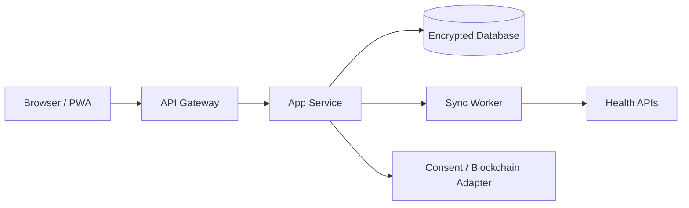

# Software Requirements Specification (SRS)

## BS BioSync — MVP

**Tagline:** Your Health. Your Data. Your Control.  
**Supporting line:** MOVE • SYNC • OWN  
**Dokumen:** SRS v0.1 — Draft MVP  
**Platform:** Responsive Web App / PWA

## 1. Pendahuluan

### 1.1 Tujuan

BS BioSync adalah web app kesehatan preventif yang menggabungkan pencatatan aktivitas, data perangkat kesehatan, AI-assisted insight, gamifikasi, serta kontrol kepemilikan data berbasis Web3.

Dokumen ini menjadi acuan product owner, UI/UX designer, developer, QA, dan stakeholder dalam membangun MVP.

### 1.2 Masalah yang diselesaikan

- Data kesehatan pengguna tersebar di banyak aplikasi dan perangkat.
- Pengguna sulit memahami tren kesehatan sehari-hari.
- Motivasi berolahraga menurun tanpa target dan komunitas.
- Pengguna membutuhkan transparansi atas siapa yang dapat mengakses data mereka.

### 1.3 Sasaran MVP

- Pengguna dapat membuat akun dan profil kesehatan dasar.
- Pengguna dapat menghubungkan minimal satu sumber data kesehatan.
- Pengguna dapat melihat aktivitas dan metrik kesehatan dalam dashboard.
- Pengguna dapat mengikuti challenge dan memperoleh badge.
- Pengguna dapat mengekspor, mencabut akses, dan menghapus datanya.
- Fitur wallet/blockchain tersedia sebagai beta dan bersifat opsional.

### 1.4 Di luar cakupan MVP

- Diagnosis penyakit atau pengganti konsultasi tenaga medis.
- Penyimpanan rekam medis mentah di blockchain publik.
- Token yang dapat diperdagangkan atau mekanisme investasi.
- Marketplace data kesehatan tanpa persetujuan eksplisit pengguna.

## 2. Deskripsi produk

### 2.1 Persona

| Persona | Kebutuhan utama |
|---|---|
| Active User | Tracking lari, jalan, gym, target, dan statistik |
| Wellness User | Tidur, langkah, detak jantung, berat badan, recovery |
| Coach/Community | Challenge, leaderboard, dan insight yang dibagikan |
| Data Owner | Kontrol izin, export, revoke, dan delete data |
| System Admin | Monitoring sistem, user, integrasi, dan moderasi |

### 2.2 Prinsip produk

1. Privacy by design.
2. Pengguna tetap dapat memakai fitur utama tanpa wallet.
3. Data kesehatan diproses dan disimpan secara terenkripsi off-chain.
4. Blockchain digunakan untuk consent, audit, verification hash, dan ownership.
5. Insight AI bersifat informatif, transparan, dan tidak memberikan diagnosis.

### 2.3 Identitas visual

- Logo: monogram BS dalam shield dengan garis ECG/sinkronisasi.
- Warna: navy `#071A2F`, teal `#16D6C3`, mint `#45D9B6`, lime `#B7F34A`, off-white `#F5F8FC`.
- Font: Inter.
- UI: mobile-first, kartu rounded 16–24 px, visual health-tech premium.

## 3. Aktor dan hak akses

| Aktor | Hak akses |
|---|---|
| Guest | Melihat landing page dan informasi produk |
| User | Mengelola profil, aktivitas, metrik, challenge, consent, dan data |
| Coach/Community | Mengelola challenge yang dibuatnya dan melihat data yang dibagikan |
| Admin | Mengelola user, challenge, integrasi, laporan, dan audit |
| Device Provider | Mengirim data melalui OAuth/API sesuai izin pengguna |
| Blockchain Network | Menyimpan transaksi consent/verification tanpa data mentah |

## 4. Kebutuhan fungsional

### FR-01 — Registrasi dan autentikasi

- Sistem harus mendukung email/password dan social login yang dikonfigurasi.
- Sistem harus memverifikasi email dan menyediakan reset password.
- Sistem harus menyediakan logout dari perangkat aktif.
- Sistem harus menerapkan rate limit dan autentikasi dua faktor sebagai fitur lanjutan.

### FR-02 — Onboarding dan profil

- Pengguna dapat memilih tujuan: stamina, berat badan, tidur, strength, atau stress.
- Pengguna dapat mengisi rentang usia, tinggi, berat, dan level aktivitas.
- Pengguna dapat melewati onboarding dan melengkapinya kemudian.
- Pengguna dapat mengubah profil serta menghapus data profil.

### FR-03 — Integrasi perangkat

- Pengguna dapat menghubungkan Apple Health, Google Fit/Health Connect, Samsung Health, Garmin, atau Fitbit jika API/izin tersedia.
- Sistem harus meminta izin per kategori data, bukan meminta akses menyeluruh tanpa penjelasan.
- Sistem harus menyimpan token integrasi secara terenkripsi.
- Sistem harus menampilkan status connected, sync time, error, dan tombol disconnect.
- Sistem harus mencegah duplikasi aktivitas dari sumber yang sama.

### FR-04 — Dashboard

- Dashboard menampilkan daily score, streak, langkah, kalori, heart rate, dan ringkasan aktivitas.
- Pengguna dapat memilih rentang harian, mingguan, atau bulanan.
- Dashboard menampilkan rekomendasi aktivitas umum berbasis data yang tersedia.
- Sistem harus memberi label bahwa insight bukan diagnosis medis.

### FR-05 — Activity tracking

- Pengguna dapat memulai, menjeda, melanjutkan, dan mengakhiri aktivitas.
- Sistem dapat merekam waktu, durasi, jarak, pace, rute, elevasi, kalori, dan heart-rate zone bila tersedia.
- Sistem menampilkan ringkasan serta riwayat aktivitas.
- Pengguna dapat menyembunyikan rute presisi saat membagikan aktivitas.
- Pengguna dapat menghapus aktivitas tertentu.

### FR-06 — Health metrics

- Sistem menampilkan tren sleep, heart, body, recovery, dan aktivitas.
- Grafik menyediakan periode 7, 30, dan 90 hari.
- Nilai yang tidak tersedia ditampilkan sebagai empty state, bukan nol.
- Sistem memberi indikator informasi, perhatian, atau perlu konsultasi; sistem tidak mendiagnosis.

### FR-07 — Challenge dan gamifikasi

- Pengguna dapat membuat atau mengikuti challenge.
- Challenge memiliki nama, target, periode, aturan, visibilitas, dan jumlah peserta.
- Sistem menghitung progress berdasarkan aktivitas tervalidasi.
- Sistem menyediakan leaderboard dan riwayat pencapaian.
- Sistem memberi badge seperti First Move, 10K Steps, dan 7-Day Streak.

### FR-08 — Berbagi aktivitas

- Pengguna dapat membuat share card tanpa mengekspos data privat.
- Pengguna dapat memilih metrik yang dibagikan.
- Rute GPS dapat disamarkan atau dihilangkan.
- Setiap aktivitas yang dibagikan dapat dicabut aksesnya.

### FR-09 — Privacy Center

- Pengguna dapat melihat kategori data yang tersimpan.
- Pengguna dapat melihat aplikasi/akun yang memiliki akses.
- Pengguna dapat menetapkan durasi izin akses.
- Pengguna dapat revoke access, download data, dan delete account.
- Perubahan consent dicatat ke audit log.

### FR-10 — Web3 ownership beta

- Wallet connect bersifat opsional.
- Sistem dapat membuat atau menghubungkan decentralized identity.
- Sistem dapat menyimpan hash verifikasi dan referensi consent di blockchain.
- Sistem tidak boleh menyimpan nama, email, GPS, heart rate, atau rekam kesehatan mentah di blockchain publik.
- Badge/NFT achievement bersifat opsional dan tidak boleh menjadi syarat penggunaan fitur utama.

### FR-11 — Admin

- Admin dapat melihat status user, integrasi, challenge, error sinkronisasi, dan audit event.
- Admin tidak dapat membaca data kesehatan sensitif tanpa permission khusus dan alasan yang tercatat.
- Admin dapat menonaktifkan akun yang melanggar kebijakan dan menyimpan alasan tindakan.

## 5. Kebutuhan nonfungsional

| ID | Kebutuhan | Target MVP |
|---|---|---|
| NFR-01 | Performance | LCP halaman utama ≤ 2,5 detik pada koneksi 4G |
| NFR-02 | Availability | Target layanan 99,5% per bulan |
| NFR-03 | Security | TLS, password hashing kuat, encrypted secrets, RBAC, audit log |
| NFR-04 | Privacy | Consent granular, export, revoke, delete, minimisasi data |
| NFR-05 | Accessibility | Keyboard support, kontras memadai, label screen reader |
| NFR-06 | Responsive | 360 px mobile sampai desktop 1440 px |
| NFR-07 | Scalability | API stateless dan background job untuk sinkronisasi |
| NFR-08 | Observability | Error tracking, sync log, health check, dan alert |

## 6. Arsitektur tingkat tinggi

Komponen yang disarankan: frontend React/Next.js PWA, backend REST API, relational database, object storage terenkripsi, queue worker, OAuth provider, dan blockchain adapter terpisah.

## 7. Model data minimum

Entitas utama: `users`, `profiles`, `goals`, `devices`, `device_tokens`, `activities`, `health_metrics`, `sleep_records`, `challenges`, `challenge_members`, `badges`, `user_badges`, `consents`, `audit_logs`, `wallets`, dan `verification_records`.

Aturan: semua tabel data sensitif memiliki `user_id`, timestamp, sumber data, status consent, dan retention policy. Token perangkat tidak boleh disimpan dalam bentuk plaintext.

## 8. API minimum

| Method | Endpoint | Fungsi |
|---|---|---|
| POST | `/api/v1/auth/register` | Registrasi |
| POST | `/api/v1/auth/login` | Login |
| GET | `/api/v1/dashboard` | Ringkasan dashboard |
| GET/POST | `/api/v1/activities` | Riwayat dan pencatatan aktivitas |
| GET | `/api/v1/health/summary` | Ringkasan metrik kesehatan |
| GET/POST | `/api/v1/devices` | Connect dan disconnect perangkat |
| GET/POST | `/api/v1/challenges` | Daftar dan membuat challenge |
| GET | `/api/v1/privacy/consents` | Melihat izin akses |
| POST | `/api/v1/privacy/export` | Meminta export data |
| DELETE | `/api/v1/account` | Penghapusan akun |
| POST | `/api/v1/web3/verify-consent` | Menulis bukti consent/hash |

## 9. Aturan keamanan dan privasi

- Terapkan least privilege dan RBAC.
- Enkripsi data saat transit dan saat tersimpan.
- Pisahkan data identitas dari data kesehatan bila memungkinkan.
- Gunakan pseudonymous ID untuk proses analitik dan blockchain.
- Sediakan retention policy dan proses penghapusan yang dapat diverifikasi.
- Jangan menampilkan diagnosis otomatis; insight harus menyertakan sumber dan keterbatasannya.
- Semua akses data sensitif dicatat di audit log.

## 10. Acceptance criteria MVP

- Pengguna baru dapat menyelesaikan onboarding dalam maksimal lima langkah.
- Dashboard menampilkan data nyata atau empty state yang benar.
- Minimal satu integrasi perangkat dapat melakukan sinkronisasi ulang.
- Aktivitas tersimpan tanpa duplikasi dan dapat dihapus.
- Challenge menghitung progress dan badge secara konsisten.
- User dapat mengekspor data, mencabut akses, dan mengajukan penghapusan akun.
- Tidak ada data kesehatan mentah yang ditulis ke blockchain.
- Tampilan berfungsi pada mobile 360 px dan desktop 1440 px.
- QA dapat menelusuri setiap requirement `FR` ke test case.

## 11. Roadmap

### Phase 1 — Foundation

Auth, onboarding, profile, dashboard dasar, design system, database, dan audit log.

### Phase 2 — Tracking

Activity tracking, satu integrasi kesehatan, health metrics, grafik, dan export.

### Phase 3 — Community

Challenge, leaderboard, streak, badge, share card, dan moderasi.

### Phase 4 — Privacy/Web3 beta

Consent center, wallet optional, verification hash, ownership, dan NFT badge opsional.

## 12. Risiko dan mitigasi

| Risiko | Mitigasi |
|---|---|
| API perangkat berubah | Adapter per provider dan sync retry |
| Data tidak lengkap | Tampilkan sumber, timestamp, dan empty state |
| Penyalahgunaan reward | Validasi aktivitas dan rate limit |
| Kebocoran data | Encryption, RBAC, audit, secret manager, penetration test |
| Regulasi kesehatan/crypto | Legal review sebelum fitur klinis atau token diluncurkan |

