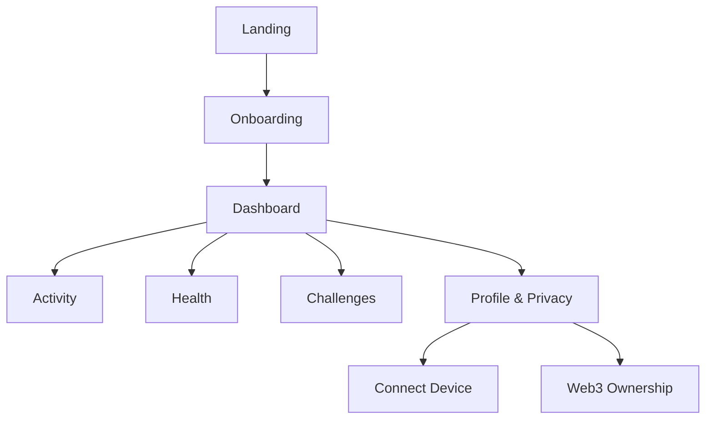

# BS BioSync — Wireframe UI/UX

Tagline: **Your Health. Your Data. Your Control.**  
Supporting line: **MOVE • SYNC • OWN**

## 1. Arah desain

- Mobile-first PWA, responsif desktop.
- Health-tech premium: navy `#071A2F`, teal `#16D6C3`, mint `#45D9B6`, lime `#B7F34A`, putih `#F5F8FC`.
- Font: Inter; kartu rounded 16–24 px; grafik sederhana dan mudah dibaca.
- Web3 bersifat opsional. Data kesehatan mentah tetap terenkripsi off-chain; blockchain untuk consent, verifikasi, dan ownership.

## 2. Struktur navigasi



Mobile bottom navigation: **Home · Activity · Health · Challenges · Profile**.

## 3. Wireframe utama

### A. Landing page

```text
[BS BioSync logo]
Your Health. Your Data. Your Control.
[Start Tracking] [Explore Features]
[health dashboard preview] [privacy / Web3 statement]
Features: Track · Sync · Challenge · Own
```

### B. Onboarding

1. Welcome — logo, tagline, CTA “Get Started”.
2. Health goals — stamina, weight, sleep, strength, stress.
3. Profile — age range, height, weight, activity level.
4. Connect device — Apple Health, Google Fit, Samsung Health, Garmin, Fitbit.
5. Privacy choice — data permission per kategori, “Skip for now”.

### C. Dashboard / Home

```text
[Good morning, User]                 [avatar]
Daily score  82/100       Streak  7 days
[Steps 8,420] [Calories 640] [Heart 76 bpm]
[weekly activity chart................]
Suggested: 20-min walk          [Start]
Latest activity: Morning Run     [View]
```

### D. Activity

- Filter: All, Run, Walk, Cycle, Gym, Yoga.
- Map route card, distance, duration, pace, elevation, heart rate.
- CTA **Start Activity** dengan permission lokasi.
- Detail activity: split, heart-rate zone, calories, share card, NFT badge opsional.

### E. Health

- Tabs: Overview, Sleep, Heart, Body, Recovery.
- Trend 7/30/90 hari.
- Status menggunakan label normal, perhatian, dan perlu konsultasi—bukan diagnosis.
- Export data JSON/CSV/PDF dan revoke access.

### F. Challenges

```text
[Weekly Challenge] 12.4 / 20 km
[Join Challenge]
Community: 2,430 participants
[Leaderboard] [My Rewards]
Badges: First Move · 10K Steps · 7-Day Streak
```

### G. Profile, Privacy, dan Web3

- Profil, connected devices, notification, language, account security.
- **Data permissions:** siapa yang dapat mengakses, jenis data, masa berlaku.
- **Ownership:** encrypted vault, consent history, verification hash, wallet optional.
- Tombol jelas: **Download My Data**, **Revoke Access**, **Delete Account**.

## 4. Komponen UI

Button primary, secondary, icon button, metric card, chart card, map card, badge, progress ring, bottom sheet, modal consent, toast, skeleton loader, empty state, error state, confirmation dialog.

## 5. Responsive layout

| Viewport | Layout |
|---|---|
| 360–767 px | 1 kolom, bottom nav, kartu full-width |
| 768–1199 px | 2 kolom, sidebar ringkas |
| 1200 px ke atas | sidebar tetap, dashboard 3 kolom |

## 6. Prioritas MVP

1. Landing, login, onboarding.
2. Dashboard dan pencatatan activity.
3. Integrasi satu sumber data: Google Fit/Health Connect.
4. Health metrics dasar dan grafik.
5. Challenge, streak, badge.
6. Privacy center dan export/delete data.
7. Web3 consent/ownership sebagai fitur beta.

